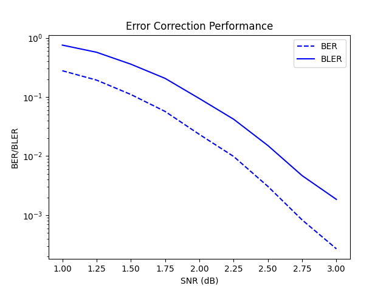

# Project POCO

Welcome to Project POCO, a sophisticated simulator for Successive Cancellation (SC) decoding of Polar Codes—a pivotal technology in achieving high-speed data rates for 5G networks. At the core of modern communication systems, Polar Codes have become a cornerstone in the evolution of error correction techniques.

## Table of Contents
- [Introduction](#introduction)
- [Features](#features)
- [Getting Started](#getting-started)
  - [Prerequisites](#prerequisites)
  - [Installation](#installation)
  - [Usage](#usage)
- [Contributing](#contributing)
  - [Code Contributions](#code-contributions)
  - [Bug Reports/Feature Requests](#bug-reportsfeature-requests)
  - [Coding Guidelines](#coding-guidelines)
  - [Pull Request Guidelines](#pull-request-guidelines)
- [License](#license)
- [Acknowledgments](#acknowledgments)


## Introduction

Fast decoding techniques serve as the linchpin for realizing the ambitious data rates of 5G networks. Among these, the Successive Cancellation (SC) algorithm stands out as the original solution to the challenges posed by Polar Codes. This groundbreaking algorithm has undergone further refinement, paving the way for the development of sophisticated list and flip decoders.

**Project POCO** is an advanced simulation environment specifically designed for SC decoding of Polar Codes. Leveraging state-of-the-art decoding techniques sourced from the literature, our simulator is tailored to provide an unparalleled understanding and analysis of Polar Code decoding processes.

## Features

- **Enhanced Reconfigurability Support:**
  The POCO simulator can work with any polar code with size $2^n, n \in \mathbb{Z}$, including but not limited to, 5G polar codes or any other reliability order of the user's choice.

- **Fast and Simplified Decoding Support:**
  The POCO simulator encapsulates the simplified and fast decoding techniques which made polar decoders practical in the first place. 

- **Fixed/Floating Point Support:**
  With enabled fixed point support, hardware approximate performance curves can be obtained for quantizations of user's choice.

- **Fast Turnaround Time:**
  Each performance plot point may take time based on specific configurations. Speedups at various points of the algorithm are employed, including but not limited to:
  - Batch operation support to bundle operations alike
  - Bypass decoding where result is guaranteed.

- **Performance Plot Visualization:**
  Using Python's matplotlib library, performance plots for bit/frame error rates can be obtained upon successful completion of the simulation.


## Getting Started

Guide users through the process of setting up and running your project.

### Prerequisites

The following Python libraries are required:

- **numpy** (version 1.21.2)
  ```bash
  pip install numpy==1.21.2
  ```
- **matplotlib** (version 3.4.3)
  ```bash
  pip install matplotlib==3.4.3
  ```

By experience, make sure you are using the correct Python Interpreter in case the installed packages are unrecognized.

### Installation

No complex installation procedures are required beyond ensuring the prerequisite libraries are in place. If you're a VSCode user, open the repository as a folder (project) and execute the `main.py` script. Our script utilizes JSON files for configuration, and a plethora of examples are readily available for users to explore and leverage.

### Usage

The simulation setup is carried out using the `config.json` file. An example snapshot is provided below:

```json
{
    "filepath_polar_rel_idx" : "src/lib/ecc/polar/3gpp/n1024_3gpp.pc",
    "info_bit_length" : 512,

    "snr_start" : 1,
    "snr_end" : 3,
    "snr_step" : 0.25,
    
    "num_frames" : 10000,
    "num_errors" : 50,
    "num_max_fr" : 1000000,

    "qbits_enable" : 0,
    "qbits_chnl"   : 5,
    "qbits_intl"   : 6,
    "qbits_frac"   : 1,

    "plot_enable"  : 0,

    "fast_r0_enable" : 1,
    "fast_r1_enable" : 1,
    "fast_rep_enable" : 1,
    "fast_spc_enable" : 1,
    "fast_0011_enable" : 0,
    "fast_0101_enable" : 0,

    "fast_r0_max_size" : 1024,
    "fast_r1_max_size" : 1024,
    "fast_rep_max_size" : 1024,
    "fast_spc_max_size" : 1024
}
```

The following example is a terminal output of POCO with 5G polar codes of N=1024, K=512:
```
#################################################################################
#                                                                               #
#  Successive Cancellation Decoder for Polar Codes            __                #
#  Author: Furkan Ercan                               _(\    |@@|               #
#                                                    (__/\__ \--/ __            #
#  Copyright (c) 2024 Furkan Ercan.                     \___|----|  |   __      #
#  All Rights Reserved.                                  \ }{ /\ )_ / _\ _\     #
#                                                           /\__/\ \__O (__     #
#  Version: 1.0                                            (--/\--)    \__/     #
#                                                          _)(  )(_             #
#  Licensed under the MIT License                         `---''---`            #
#  See the LICENSE file for details.                                            #
#                                                                               #
#  ASCII Art Source: https://www.asciiart.eu/                                   #
#                                                                               #
#################################################################################

SNR (dB)    BER           FER           ITER       Frames     Errors     Time
1.000e+00   2.85691e-01   7.72100e-01   1.00e+00   1.00e+04   7.72e+03   00:00:18
1.250e+00   2.02637e-01   5.94800e-01   1.00e+00   1.00e+04   5.95e+03   00:00:19
1.500e+00   1.17783e-01   3.78800e-01   1.00e+00   1.00e+04   3.79e+03   00:00:19
1.750e+00   6.06721e-02   2.18000e-01   1.00e+00   1.00e+04   2.18e+03   00:00:19
2.000e+00   2.50111e-02   1.00900e-01   1.00e+00   1.00e+04   1.01e+03   00:00:19
2.250e+00   1.03396e-02   4.38000e-02   1.00e+00   1.00e+04   4.38e+02   00:00:26
2.500e+00   3.03535e-03   1.51000e-02   1.00e+00   1.00e+04   1.51e+02   00:00:31
2.750e+00   8.36343e-04   4.71698e-03   1.00e+00   1.06e+04   5.00e+01   00:00:21
3.000e+00   2.67857e-04   1.93050e-03   1.00e+00   2.59e+04   5.00e+01   00:00:59
```



## Contributing

We welcome contributions to improve POCO! Whether you want to report a bug, request a new feature, or contribute code changes, your help is appreciated.

### Code Contributions

1. Fork the repository.
2. Create a new branch for your feature or bug fix: `git checkout -b feature-name`.
3. Make your changes and commit them: `git commit -m 'Description of the changes'`.
4. Push your changes to the new branch: `git push origin feature-name`.
5. Submit a pull request to the `main` branch.

### Bug Reports/Feature Requests

If you encounter a bug, please open an issue on the [issue tracker](link-to-issue-tracker) with a detailed description, steps to reproduce, and any relevant information.

If you have a feature request, open an issue on the [issue tracker](link-to-issue-tracker) with a clear description of the proposed feature and why it would be beneficial.

### Coding Guidelines

Please adhere to our coding guidelines. If your contribution involves changes to the codebase, make sure to follow the established coding style and conventions.

### Pull Request Guidelines

Before submitting a pull request, ensure that your code passes any existing tests and include tests for your changes if applicable. Also, update the documentation if needed.

Thank you for contributing to POCO!

## License

This project is licensed under the MIT License - see the [LICENSE](LICENSE) file for details.

## Acknowledgments

If you find this project helpful or use it in your work, we kindly ask that you give credit by including the following attribution in your documentation or project credits:

The results of this work is obtained through POCO, developed by Furkan Ercan.